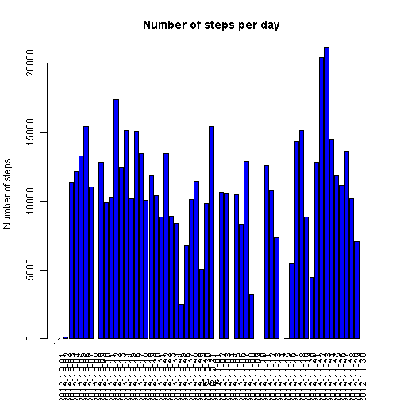
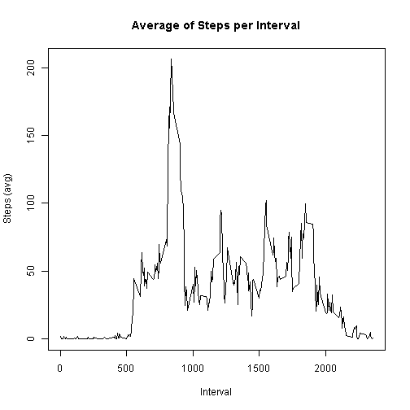
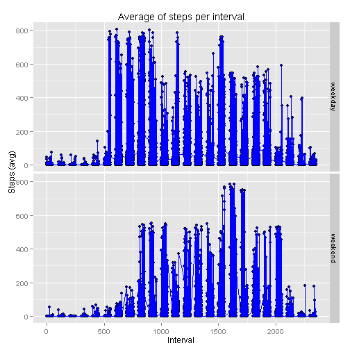

## Introduction

It is now possible to collect a large amount of data about personal movement using activity monitoring devices such as a Fitbit, Nike Fuelband, or Jawbone Up. These type of devices are part of the "quantified self" movement - a group of enthusiasts who take measurements about themselves regularly to improve their health, to find patterns in their behavior, or because they are tech geeks. But these data remain under-utilized both because the raw data are hard to obtain and there is a lack of statistical methods and software for processing and interpreting the data.

The data was downloaded from the course web site: <https://class.coursera.org/repdata-005/human_grading/view/courses/972590/assessments/3/submissions>.

The variables included in this dataset were:

- steps: Number of steps taking in a 5-minute interval (missing values are coded as NA)
- date: The date on which the measurement was taken in YYYY-MM-DD format
- interval: Identifier for the 5-minute interval in which measurement was taken

The dataset was stored in a comma-separated-value (CSV) file and there were a total of 17,568 observations in this dataset.


## Load and Preprocessing data

First, we should load data by reading the csv file, as well as make sure that we manage the appropiate variable types:


```r
  data<-read.csv("activity.csv")
  data$date <- as.Date(data$date)
```

Then, as a mean of preparing for our analysis, we should import all of the neccesary libraries:


```r
  library("xtable")
  library("knitr")
  library("plyr")
  library("timeDate")
```

```
## 
## Attaching package: 'timeDate'
## 
## The following object is masked from 'package:xtable':
## 
##     align
```

```r
  library("ggplot2")
```

For a detailed description of those libraries, see <http://cran.r-project.org/web/packages/available_packages_by_date.html>.


## Analyzing data

### What is mean total number of steps taken per day?

Beginning our analysis, we would like to know the number of steps taken per day; for that sake, a histogram should help us to understand the distribution of number of steps taken by date:


```r
  groupedData<-tapply(data$steps,data$date,FUN=sum)
  bp<-barplot(groupedData,col="blue",main="Number of steps per day",ylab="Number of steps",xlab="Day",las=3)
  labs <- paste(names(table(data$date)), "Days")
  text(cex=0.02, x=-.25, y=-1.25, labs, xpd=TRUE, srt=45)
```

 

```r
  #See figures/plot1.png
```


### What is the average daily activity pattern?

Now, we would like to obtain some statistics about our data, in particular the mean and the median of the number of steps taken each day; following the next R code you can see mean and median values for each of the days:


```r
  meanTable<-tapply(data$steps,data$date,FUN=mean)
  medianTable<-tapply(data$steps,data$date,FUN=median)
  resultsTable<-data.frame(day=unique(data$date),mean=meanTable,median=medianTable)
  finalTable<-kable(resultsTable)
```


### What is mean total number of steps taken per interval?

In the same way as for the days, we would like to know the distribution of steps taken by interval of 5 minutes; we would like to know the average number of steps taken at each measured interval:


```r
  groupedData <- ddply(data,c("interval"),summarise,steps=mean(steps,na.rm=TRUE))
  plot(groupedData$interval,groupedData$steps,type="l",pch=".",xlab="Interval",ylab="Steps (avg)",main="Average of Steps per Interval")
```

 

```r
  #See figures/plot2.png
```


### What is the maximum number of steps taken per interval, and the corresponding interval?

As for the sum of steps per interval, next we show the top 10 number of steps grouped by interval: 


```r
  sumTable<-ddply(data,c("interval"),summarise,steps=sum(steps,na.rm=TRUE))
  orderedTable<-sumTable[with(sumTable,order(-steps)),]
  orderedTable<-head(orderedTable,10)
  finalTable<-kable(orderedTable)
```

Here, we can see that the interval with the higher number of total steps is the 835 interval.


### Imputing missing values

In the analysis performed before, we have observed that a certain number of null (NA) values exist. When looking at the number of NA values in our 17,568 rows, we obtain the following results:


```r
  rows<-nrow(data)
  noNARows<-nrow(na.omit(data))
  total<-rows-noNARows
  total
```

```
## [1] 2304
```

Here, we can see that a total of 2304 rows correspond to NA values in the steps variable. For obtaining more accurate results, we would like to fill-in NA variables; for that sake, each NA value in the steps variable is replaced by the mean value along its corresponding interval:


```r
  newData<-data
  summTable<-ddply(data,c("interval"),summarise,steps=mean(steps,na.rm=TRUE)) 
  
  for(i in 1:nrow(newData))
  {
    if(is.na(newData$steps[[i]]))
    {
      for(j in 1:nrow(summTable))
      {
        if(newData$interval[[i]]==summTable$interval[[j]])
        {
          newData$steps[[i]]<-summTable$steps[[j]]
        }
      }
    }
  }
```


### Are there differences in activity patterns between weekdays and weekends?

Finally, we would like to know the distribution of our data not only by individual date, by four whether the day corresponds to a weekend or to a weekday. For accomplishing this, we need to add a new factor variable to our data, with two possible values/levels (weekend and weekday):


```r
  newData$weekday<-factor(NA,c("weekday","weekend"))
  newData$weekday[isWeekend(newData$date)]<-"weekend"
  newData$weekday[!isWeekend(newData$date)]<-"weekday"
```

Once our new variable has been created, we can see an example of the data with this variable included (top 10 rows):


```r
  head(newData,10)
```

```
##        steps       date interval weekday
## 1  1.7169811 2012-10-01        0 weekday
## 2  0.3396226 2012-10-01        5 weekday
## 3  0.1320755 2012-10-01       10 weekday
## 4  0.1509434 2012-10-01       15 weekday
## 5  0.0754717 2012-10-01       20 weekday
## 6  2.0943396 2012-10-01       25 weekday
## 7  0.5283019 2012-10-01       30 weekday
## 8  0.8679245 2012-10-01       35 weekday
## 9  0.0000000 2012-10-01       40 weekday
## 10 1.4716981 2012-10-01       45 weekday
```

With this data, we can see the differences of activity between weekends and weekdays:


```r
  groupedData <- ddply(newData,c("interval","weekday","date"),summarise,steps=mean(steps))
  qplot(interval,steps,data=groupedData)+geom_line(size=0.1,col="blue")+geom_point(size=0.01,col="blue")+labs(x="Interval",y="Steps (avg)",title="Average of steps per interval")+facet_grid(weekday~.)
```

 

```r
  #See figures/plot3.png
```
